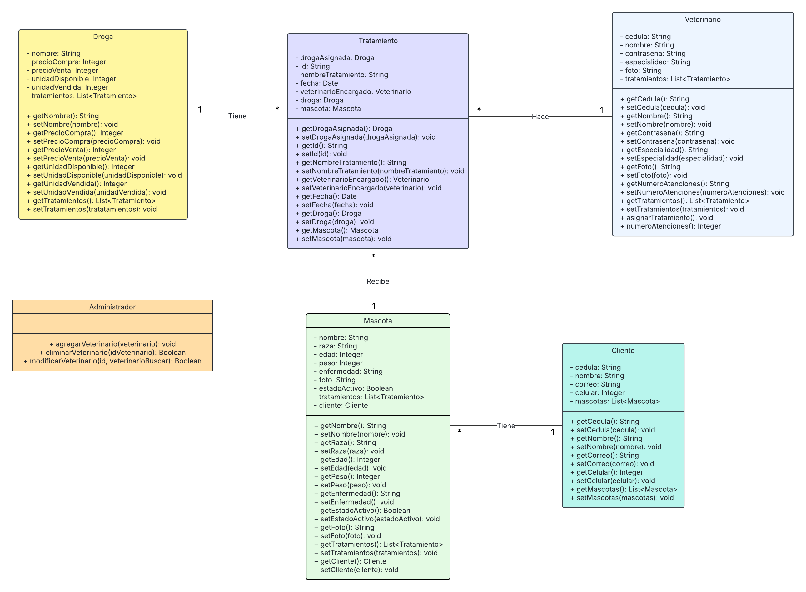
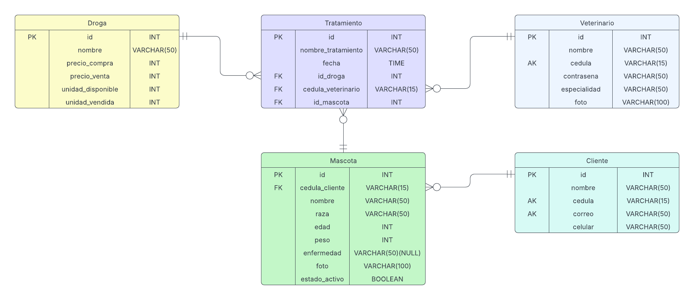

# Índice de Secciones

1. [Proyecto Desarrollo Web](#proyecto-desarrollo-web)  
2. [Veterinaria](#veterinaria)  
3. [Integrantes](#integrantes)  
4. [Introducción del Proyecto](#introducción-del-proyecto)  
5. [Estructura del Sitio Web](#estructura-del-sitio-web)  
   - [Landing Page](#landing-page)  
   - [Información de los Profesionales de la Veterinaria](#información-de-los-profesionales-de-la-veterinaria)  
   - [Información de la Veterinaria](#información-de-la-veterinaria)  
6. [Iniciar Sesión](#iniciar-sesión)  
7. [CRUD Mascotas](#crud-mascotas)  
   - [Información Detallada de la Mascota](#información-detallada-de-la-mascota)  
   - [Actualizar Información de la Mascota](#actualizar-información-de-la-mascota)  
8. [CRUD Clientes](#crud-clientes)  
   - [Información Detallada del Cliente](#información-detallada-del-cliente)  
   - [Actualizar Información del Cliente](#actualizar-información-del-cliente)  
9. [Diagrama de Clases](#diagrama-de-clases)  

10. [Diagrama Entidad Relacion](#diagrama-entidad-relacion)

---

# Proyecto Desarrollo Web

## Veterinaria

## Integrantes:

- **Erick Salazar Suarez**  
- **Juan Eduardo Diaz Rojas**  
- **David Cuadros Astro**  

## Introducción del proyecto  
Este proyecto consiste en el desarrollo de un sitio web diseñado para optimizar la gestión de una veterinaria, permitiéndole llevar un registro detallado de sus clientes, las mascotas que atienden y los tratamientos aplicados a cada una. Además, el sistema facilita la administración del personal veterinario, asegurando un control eficiente sobre los empleados y sus funciones dentro del establecimiento. Como complemento, la plataforma incluye un **dashboard interactivo** que presenta los indicadores y resultados más relevantes para la veterinaria, proporcionando una visión clara y en tiempo real del desempeño del negocio, la frecuencia de atención, los tratamientos más aplicados y otros datos clave que contribuyen a la toma de decisiones estratégicas.  

Asimismo, el sitio web ofrece información sobre la veterinaria, incluyendo una sección de **"Quiénes somos"**, donde se detalla la misión y visión del establecimiento, perfiles de los profesionales que trabajan en el equipo y un apartado de contacto para facilitar la comunicación con los clientes.  

---

## **Estructura del Sitio Web**  

### **Landing Page**  
  

La página de bienvenida del sitio presenta el logo de la veterinaria junto con una serie de botones de acceso que permiten a los usuarios **iniciar sesión, registrarse y acceder directamente a la gestión de mascotas y clientes** a través del CRUD correspondiente. Además, incluye **tres botones de anclaje** que facilitan la navegación dentro de la misma página, redirigiendo a secciones específicas más abajo donde se muestra información detallada sobre la veterinaria, su misión y visión, así como los perfiles de los profesionales que forman parte del equipo.  

### **Información de los profesionales de la veterinaria**  
  

### **Información de la veterinaria**  
  

---

## **Iniciar sesión**  
  

El inicio de sesión requiere un **correo electrónico y una cédula**. En caso de que los datos no estén registrados en el sitio, se mostrará un mensaje en pantalla indicando que la información es incorrecta.  

  

---

## **CRUD Mascotas**  
.png?raw=true)  

Al hacer clic en el botón **"Ver Mascotas"** en el `index.html`, se despliega una página que muestra todas las mascotas registradas en el sitio junto con su información detallada, incluyendo **foto, nombre, edad, peso y enfermedad**.  

Además, la página cuenta con **tres botones de acción**:  
- **Visualizar** en detalle la información de una mascota seleccionada.  
- **Actualizar** los datos de la mascota.  
- **Eliminar** su registro del sistema.  

### **Información detallada de la mascota**  
  

### **Actualizar información de la mascota**  
  

---

## **CRUD Clientes**  
  

Al hacer clic en el botón **"Ver Clientes"** en el `index.html`, se despliega una página que muestra todos los clientes registrados en el sitio junto con su información detallada, incluyendo **nombre, email, cédula y celular**.  

Además, la página cuenta con **tres botones de acción**:  
- **Visualizar** en detalle la información de un cliente seleccionado.  
- **Actualizar** los datos del cliente.  
- **Eliminar** su registro del sistema.  

### **Información detallada del cliente**  
  

En la información detallada del cliente se muestran sus **datos registrados y su mascota asociada**. También se ofrece la opción de hacer clic en el botón **"Ver Mascota"** para visualizar su información en detalle.  

### **Actualizar información del cliente**  
  

---

## **Diagrama de Clases**  
  

---

## **Diagrama Entidad-Relacion**
