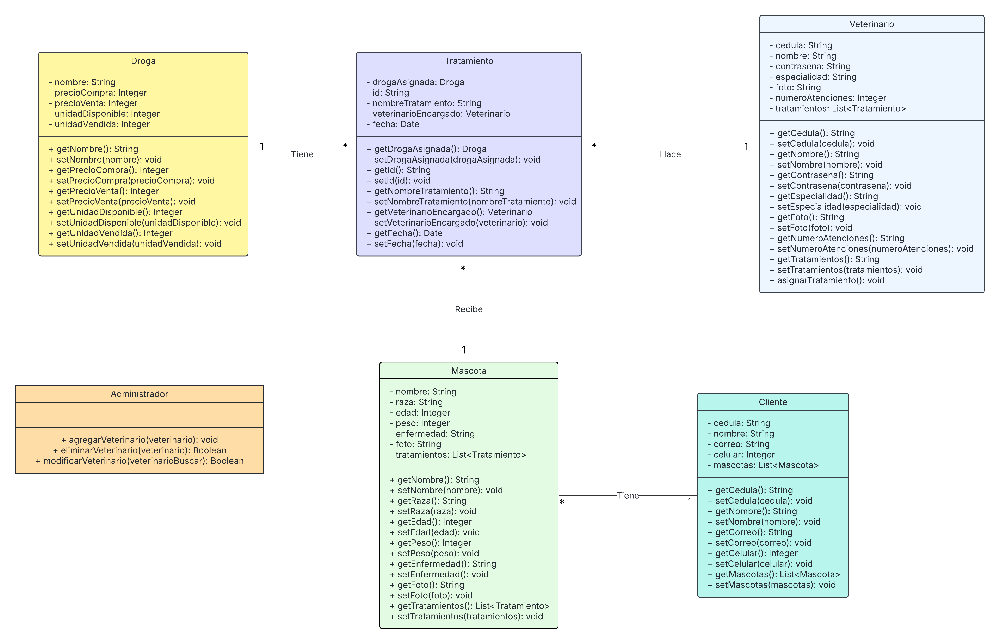

# Proyecto Desarollo Web

## Veterinaria

## Integrantes:

- ## Erick Salazar Suarez
- ## Juan Eduardo Diaz Rojas
- ## David Cuadros Astro

## Introduccion del proyecto: 
## Este proyecto consiste en el desarrollo de un sitio web diseñado para optimizar la gestión de las veterinarias, permitiéndoles llevar un registro detallado de sus clientes, las mascotas que atienden y los tratamientos aplicados a cada una. Además, el sistema facilita la administración del personal veterinario, asegurando un control eficiente sobre los empleados y sus funciones dentro del establecimiento. Como complemento, la plataforma incluye un dashboard interactivo que presenta los indicadores y resultados más relevantes para la veterinaria, proporcionando una visión clara y en tiempo real del desempeño del negocio, la frecuencia de atención, los tratamientos más aplicados y otros datos clave que contribuyen a la toma de decisiones estratégicas. Asimismo, el sitio web ofrece información sobre la veterinaria, incluyendo una sección de "Quiénes somos", donde se detalla la misión y visión del establecimiento, perfiles de los profesionales que trabajan en el equipo y un apartado de contacto para facilitar la comunicación con los clientes.

## Objetivos: 

## Estructura Sitio web:
![Imagen inicial].(https://github.com/ErickSalazar07/Web/blob/main/imagenes/imagenes-funcionalidad/image.png?raw=true)

## `Diagrama de clases`

   

## `Diagrama Entidad-Relacion`
