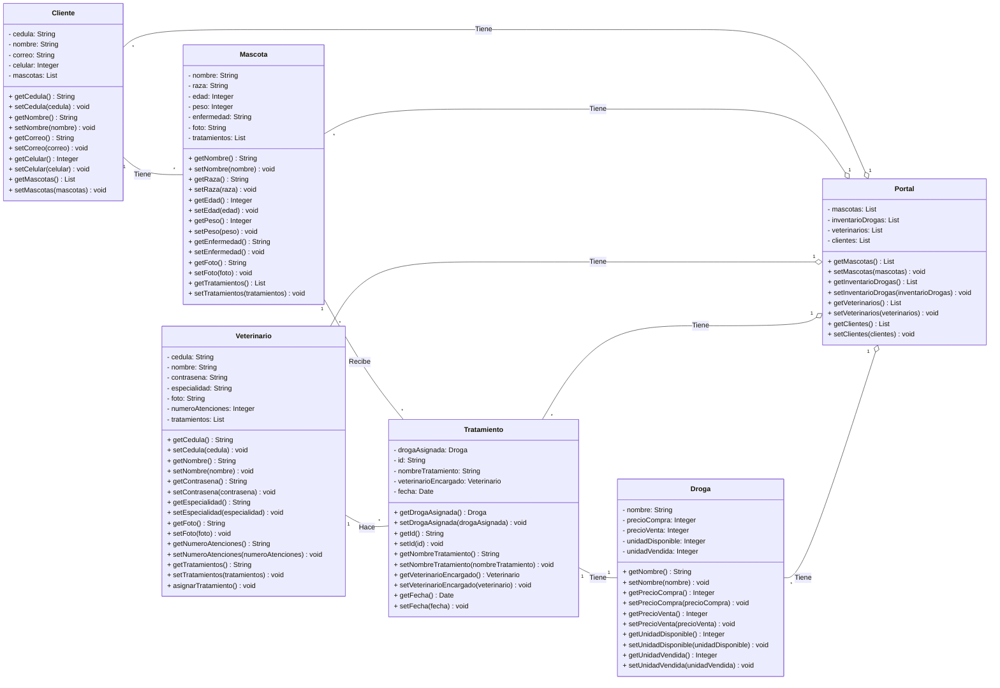

# Proyecto Desarollo Web

## Veterinaria

## Integrantes:

- ## Erick Salazar Suarez
- ## Juan Eduardo Diaz Rojas
- ## David Cuadros Astro

## `Diagrama de clases`

```mermaid
classDiagram

direction LR

Cliente "*" --o "1" Portal: Tiene
Cliente "1" -- "*" Mascota: Tiene
Mascota "*" --o "1" Portal: Tiene
Mascota "1" -- "*" Tratamiento: Recibe
Veterinario "*" --o "1" Portal: Tiene
Veterinario "1" -- "*" Tratamiento: Hace
Tratamiento "*" --o "1" Portal: Tiene
Tratamiento "1" -- "1" Droga: Tiene
Droga "*" --o "1" Portal: Tiene

class Portal {
  - mascotas: List<Mascota>
  - inventarioDrogas: List<Droga>
  - veterinarios: List<Veterinario>
  - clientes: List<Cliente>
  + getMascotas() List<Mascota>
  + setMascotas(mascotas) void
  + getInventarioDrogas() List<Droga>
  + setInventarioDrogas(inventarioDrogas) void
  + getVeterinarios() List<Veterinario>
  + setVeterinarios(veterinarios) void
  + getClientes() List<Cliente>
  + setClientes(clientes) void
}

class Mascota {
  - nombre: String
  - raza: String
  - edad: Integer
  - peso: Integer
  - enfermedad: String
  - foto: String
  - tratamientos: List<Tratamiento>
  + getNombre() String
  + setNombre(nombre) void
  + getRaza() String
  + setRaza(raza) void
  + getEdad() Integer
  + setEdad(edad) void
  + getPeso() Integer
  + setPeso(peso) void
  + getEnfermedad() String
  + setEnfermedad() void
  + getFoto() String
  + setFoto(foto) void
  + getTratamientos() List<Tratamiento>
  + setTratamientos(tratamientos) void
}

class Veterinario {
  - cedula: String
  - nombre: String
  - contrasena: String
  - especialidad: String
  - foto: String
  - numeroAtenciones: Integer
  - tratamientos: List<Tratamiento>
  + getCedula() String
  + setCedula(cedula) void
  + getNombre() String
  + setNombre(nombre) void
  + getContrasena() String
  + setContrasena(contrasena) void
  + getEspecialidad() String
  + setEspecialidad(especialidad) void
  + getFoto() String
  + setFoto(foto) void
  + getNumeroAtenciones() String
  + setNumeroAtenciones(numeroAtenciones) void
  + getTratamientos() String
  + setTratamientos(tratamientos) void
  + asignarTratamiento() void
}

class Tratamiento {
  - drogaAsignada: Droga
  - id: String
  - nombreTratamiento: String
  - veterinarioEncargado: Veterinario
  - fecha: Date
  + getDrogaAsignada() Droga
  + setDrogaAsignada(drogaAsignada) void
  + getId() String
  + setId(id) void
  + getNombreTratamiento() String
  + setNombreTratamiento(nombreTratamiento) void
  + getVeterinarioEncargado() Veterinario
  + setVeterinarioEncargado(veterinario) void
  + getFecha() Date
  + setFecha(fecha) void
}

class Cliente {
  - cedula: String
  - nombre: String
  - correo: String
  - celular: Integer
  - mascotas: List<Mascota>
  + getCedula() String
  + setCedula(cedula) void
  + getNombre() String
  + setNombre(nombre) void
  + getCorreo() String
  + setCorreo(correo) void
  + getCelular() Integer
  + setCelular(celular) void
  + getMascotas() List<Mascota>
  + setMascotas(mascotas) void
}

class Droga {
  - nombre: String
  - precioCompra: Integer
  - precioVenta: Integer
  - unidadDisponible: Integer
  - unidadVendida: Integer
  + getNombre() String
  + setNombre(nombre) void
  + getPrecioCompra() Integer
  + setPrecioCompra(precioCompra) void
  + getPrecioVenta() Integer
  + setPrecioVenta(precioVenta) void
  + getUnidadDisponible() Integer
  + setUnidadDisponible(unidadDisponible) void
  + getUnidadVendida() Integer
  + setUnidadVendida(unidadVendida) void
}

```